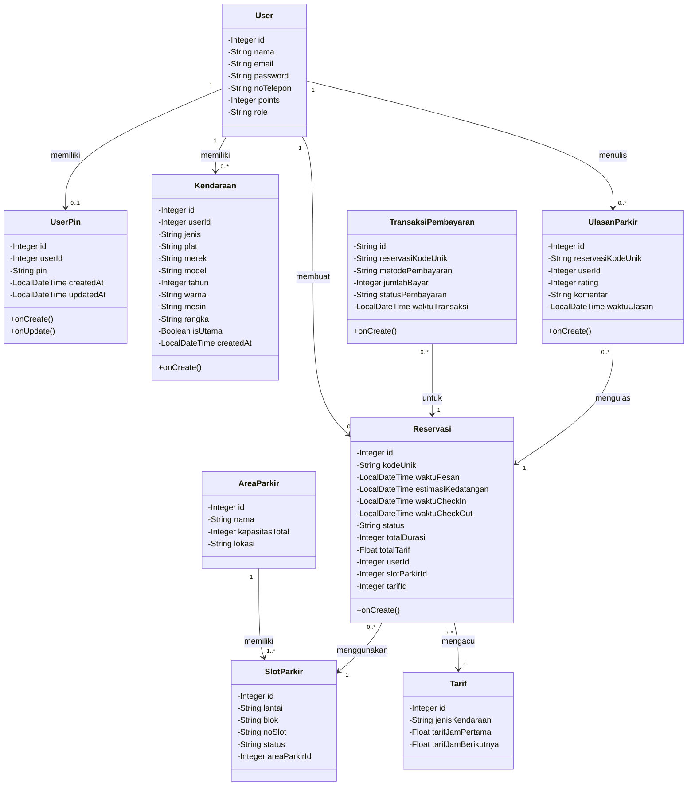
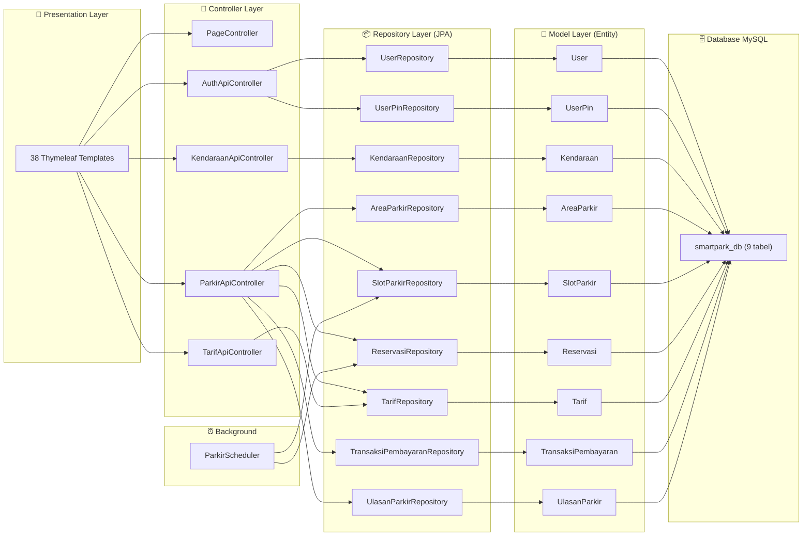

# 📐 Use Case Diagram & Class Diagram — Aplikasi Parkirin

Dokumen ini berisi **Use Case Diagram** dan **Class Diagram** yang dibuat berdasarkan analisis seluruh kode sumber proyek Parkirin (Model, Controller, Repository, dan Template HTML).

---

## 1. 📋 Use Case Diagram

Diagram berikut menampilkan interaksi antara **Aktor** dengan **Sistem Parkirin**. Terdapat 2 aktor utama:
- **Pengguna** (User) — pengguna aplikasi yang melakukan parkir
- **Sistem** (Scheduler) — proses otomatis di backend

```mermaid
graph TB
    subgraph Aktor
        U["👤 Pengguna"]
        S["⚙️ Sistem (Scheduler)"]
    end

    subgraph UC_Auth["🔐 Autentikasi & Akun"]
        UC1["Register"]
        UC2["Login"]
        UC3["Update Profil"]
        UC4["Hapus Akun"]
        UC5["Atur PIN Keamanan"]
        UC6["Verifikasi PIN"]
    end

    subgraph UC_Kendaraan["🚗 Manajemen Kendaraan"]
        UC7["Lihat Daftar Kendaraan"]
        UC8["Tambah Kendaraan"]
        UC9["Edit Kendaraan"]
        UC10["Hapus Kendaraan"]
        UC11["Set Kendaraan Utama"]
    end

    subgraph UC_Parkir["🅿️ Lokasi & Slot Parkir"]
        UC12["Lihat Lokasi Parkir"]
        UC13["Lihat Ketersediaan Slot"]
        UC14["Lihat Slot Mobil per Lantai"]
        UC15["Lihat Slot Motor per Lantai"]
    end

    subgraph UC_Booking["🎫 Reservasi & Tiket"]
        UC16["Booking Slot Parkir"]
        UC17["Lihat Riwayat Reservasi"]
        UC18["Check-In (Scan Masuk)"]
        UC19["Lihat Info Checkout"]
        UC20["Lihat Tiket QR Code"]
    end

    subgraph UC_Bayar["💳 Pembayaran & Keuangan"]
        UC21["Lihat Tarif Parkir"]
        UC22["Proses Pembayaran (Midtrans)"]
        UC23["Bayar & Checkout"]
        UC24["Lihat Poin Reward"]
    end

    subgraph UC_Lain["⭐ Fitur Pendukung"]
        UC25["Beri Ulasan & Rating"]
        UC26["Lihat Dashboard"]
        UC27["Lihat Statistik"]
        UC28["Lihat Notifikasi"]
    end

    subgraph UC_Sistem["🤖 Otomasi Sistem"]
        UC29["Auto-Reset Slot (Jam 08:00)"]
        UC30["Auto-Expire Tiket (2 Jam)"]
    end

    U --> UC1
    U --> UC2
    U --> UC3
    U --> UC4
    U --> UC5
    U --> UC6

    U --> UC7
    U --> UC8
    U --> UC9
    U --> UC10
    U --> UC11

    U --> UC12
    U --> UC13
    U --> UC14
    U --> UC15

    U --> UC16
    U --> UC17
    U --> UC18
    U --> UC19
    U --> UC20

    U --> UC21
    U --> UC22
    U --> UC23
    U --> UC24

    U --> UC25
    U --> UC26
    U --> UC27
    U --> UC28

    S --> UC29
    S --> UC30
```

---

### 📝 Deskripsi Use Case

| No | Use Case | Deskripsi | Sumber Kode |
|:--:|----------|-----------|-------------|
| 1 | Register | Pengguna mendaftar akun baru dengan nama, email, password, no telepon | `AuthApiController.register()` |
| 2 | Login | Pengguna masuk dengan email, no telepon, dan password | `AuthApiController.login()` |
| 3 | Update Profil | Mengubah nama, email, dan no telepon | `AuthApiController.updateProfile()` |
| 4 | Hapus Akun | Menghapus akun secara permanen | `AuthApiController.deleteAccount()` |
| 5 | Atur PIN Keamanan | Mengatur/mengubah PIN 6 digit untuk keamanan transaksi | `AuthApiController.setPin()` |
| 6 | Verifikasi PIN | Memverifikasi PIN sebelum melakukan aksi sensitif | `AuthApiController.verifyPin()` |
| 7 | Lihat Daftar Kendaraan | Melihat semua kendaraan yang terdaftar milik pengguna | `KendaraanApiController.getByUserId()` |
| 8 | Tambah Kendaraan | Mendaftarkan kendaraan baru (jenis, plat, merek, model, dll) | `KendaraanApiController.create()` |
| 9 | Edit Kendaraan | Mengubah data kendaraan yang sudah terdaftar | `KendaraanApiController.update()` |
| 10 | Hapus Kendaraan | Menghapus kendaraan dari daftar | `KendaraanApiController.delete()` |
| 11 | Set Kendaraan Utama | Menetapkan satu kendaraan sebagai kendaraan utama | `KendaraanApiController.setUtama()` |
| 12 | Lihat Lokasi Parkir | Melihat daftar area parkir yang tersedia | `lokasi.html`, `lokasi-list.html` |
| 13 | Lihat Ketersediaan Slot | Melihat jumlah total dan slot tersedia per area | `ParkirApiController.availability()` |
| 14 | Lihat Slot Mobil per Lantai | Melihat detail slot mobil per lantai di area tertentu | `ParkirApiController.getSlotMobil()` |
| 15 | Lihat Slot Motor per Lantai | Melihat ringkasan blok motor per lantai | `ParkirApiController.getSlotMotor()` |
| 16 | Booking Slot Parkir | Memesan slot parkir (mobil/motor) di area dan lantai tertentu | `ParkirApiController.booking()` |
| 17 | Lihat Riwayat Reservasi | Melihat semua reservasi milik pengguna | `ParkirApiController.getReservasiUser()` |
| 18 | Check-In (Scan Masuk) | Simulasi scan masuk parkir dengan mundur waktu | `ParkirApiController.bypassMasuk()` |
| 19 | Lihat Info Checkout | Melihat durasi parkir dan estimasi biaya sebelum checkout | `ParkirApiController.checkoutInfo()` |
| 20 | Lihat Tiket QR Code | Menampilkan QR Code tiket untuk scan masuk/keluar | `tiket-qr.html` |
| 21 | Lihat Tarif Parkir | Melihat daftar tarif per jenis kendaraan | `TarifApiController.getAll()` |
| 22 | Proses Pembayaran (Midtrans) | Membuat token pembayaran Midtrans Snap | `ParkirApiController.getSnapToken()` |
| 23 | Bayar & Checkout | Menyelesaikan pembayaran, update status, bebaskan slot, tambah poin | `ParkirApiController.bayar()` |
| 24 | Lihat Poin Reward | Melihat jumlah poin reward yang dikumpulkan | `ParkirApiController.getPoin()` |
| 25 | Beri Ulasan & Rating | Memberikan rating dan komentar untuk pengalaman parkir | `ParkirApiController.createUlasan()` |
| 26 | Lihat Dashboard | Melihat dashboard utama pengguna | `user-dashboard.html` |
| 27 | Lihat Statistik | Melihat statistik penggunaan parkir | `statistik.html` |
| 28 | Lihat Notifikasi | Melihat daftar notifikasi | `notification.html` |
| 29 | Auto-Reset Slot (08:00) | Sistem otomatis mereset semua slot menjadi "Tersedia" setiap jam 08:00 pagi | `ParkirScheduler.autoManageParking()` |
| 30 | Auto-Expire Tiket | Sistem otomatis membatalkan reservasi aktif yang lewat 2 jam tanpa check-in | `ParkirScheduler.autoManageParking()` |

---

## 2. 📊 Class Diagram

Diagram berikut menampilkan **9 Entity Class** beserta atribut, tipe data, dan **relasi antar class** berdasarkan foreign key yang ada di kode sumber.

---

### 📝 Penjelasan Relasi Antar Class

| Relasi | Kardinalitas | Penjelasan |
|--------|:------------:|------------|
| **User → UserPin** | 1 : 0..1 | Setiap user memiliki maksimal 1 PIN keamanan (`userId` di `UserPin` bersifat unique) |
| **User → Kendaraan** | 1 : 0..* | Satu user bisa punya banyak kendaraan (`userId` FK di `Kendaraan`) |
| **User → Reservasi** | 1 : 0..* | Satu user bisa membuat banyak reservasi (`userId` FK di `Reservasi`) |
| **User → UlasanParkir** | 1 : 0..* | Satu user bisa menulis banyak ulasan (`userId` FK di `UlasanParkir`) |
| **AreaParkir → SlotParkir** | 1 : 1..* | Satu area parkir memiliki banyak slot (`areaParkirId` FK di `SlotParkir`) |
| **Reservasi → SlotParkir** | 0..* : 1 | Banyak reservasi (berbeda waktu) bisa mengacu ke 1 slot (`slotParkirId` FK di `Reservasi`) |
| **Reservasi → Tarif** | 0..* : 1 | Banyak reservasi mengacu ke 1 jenis tarif (`tarifId` FK di `Reservasi`) |
| **TransaksiPembayaran → Reservasi** | 0..* : 1 | Banyak transaksi bisa terkait 1 reservasi (`reservasiKodeUnik` FK di `TransaksiPembayaran`) |
| **UlasanParkir → Reservasi** | 0..* : 1 | Banyak ulasan bisa mengacu ke 1 reservasi (`reservasiKodeUnik` FK di `UlasanParkir`) |

---

### 🏗️ Ringkasan Arsitektur Class

---

## 📌 Catatan

> [!NOTE]
> Semua diagram di atas dibuat berdasarkan kode sumber aktual yang ada di project. Atribut, tipe data, dan relasi diambil langsung dari file entity Java (`model/*.java`), dan use case diidentifikasi dari endpoint di controller (`controller/api/*.java`) serta template HTML (`templates/*.html`).

> [!TIP]
> Diagram Mermaid di atas dapat di-copy paste ke tools seperti [Mermaid Live Editor](https://mermaid.live) untuk menghasilkan gambar PNG/SVG yang bisa dimasukkan ke dalam laporan atau presentasi.
