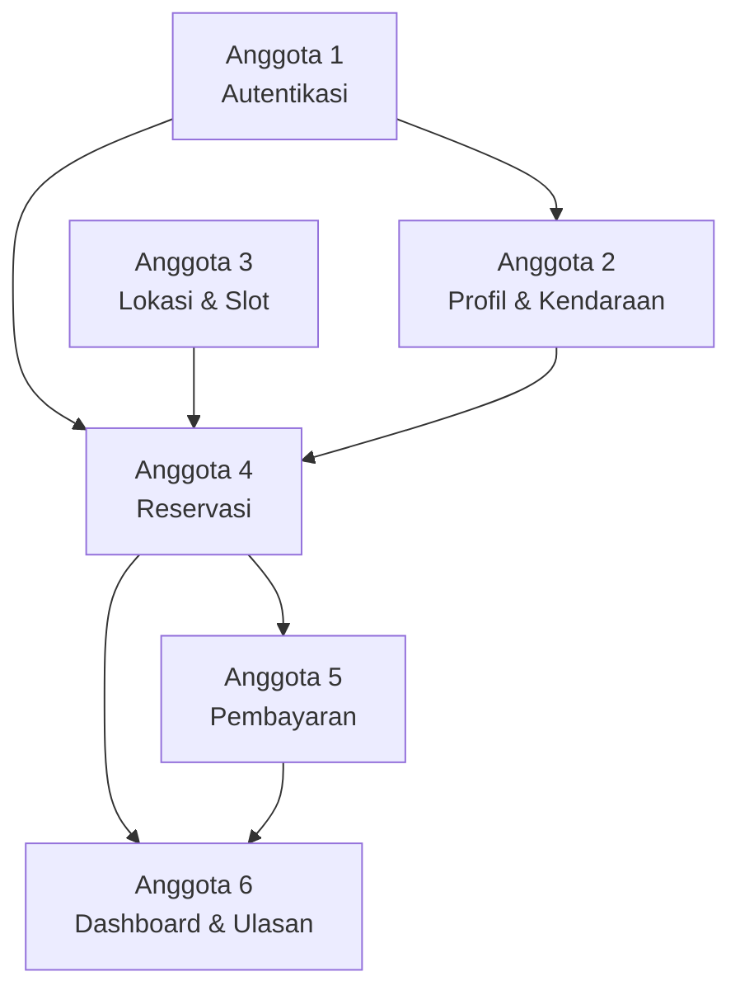

# 📋 Pembagian Tugas Proyek **Parkirin**

> Proyek ini adalah aplikasi parkir berbasis **Spring Boot** (Java) dengan frontend **Thymeleaf HTML** dan database **MySQL**.  
> Pembagian didasarkan pada fitur fungsional agar setiap anggota memiliki beban kerja yang **setara dan saling melengkapi**.

---

## 🗂️ Ringkasan Struktur Proyek

| Layer | Komponen |
|---|---|
| **Backend Model** | 9 Entity Class (User, Kendaraan, Reservasi, SlotParkir, AreaParkir, Tarif, Transaksi, Ulasan, UserPin) |
| **Backend Repository** | 9 Repository Interface |
| **Backend Controller** | PageController + 4 API Controller (Auth, Kendaraan, Parkir, Tarif) |
| **Scheduler** | ParkirScheduler |
| **Frontend Template** | 38 halaman HTML |
| **Database** | 9 tabel MySQL (`smartpark_db`) |

---

## 👤 Anggota 1 — Autentikasi & Manajemen Akun

**Fokus: Login, Register, Profil, Keamanan (PIN)**

### 🗄️ Backend
| File | Deskripsi |
|---|---|
| `model/User.java` | Entity data pengguna |
| `model/UserPin.java` | Entity PIN keamanan |
| `repository/UserRepository.java` | Akses database user |
| `repository/UserPinRepository.java` | Akses database PIN |
| `controller/api/AuthApiController.java` | Endpoint login, register, logout, forgot-password |

### 🎨 Frontend
| File | Deskripsi |
|---|---|
| `login.html` | Halaman login |
| `register.html` | Halaman registrasi |
| `register-success.html` | Halaman sukses registrasi |
| `forgot-password.html` | Halaman lupa password |
| `atur-pin.html` | Halaman atur PIN keamanan |
| `konfirmasi-pin.html` | Halaman konfirmasi PIN |
| `onboarding-1.html` | Halaman onboarding pertama |
| `onboarding-2.html` | Halaman onboarding kedua |
| `index.html` | Halaman landing/splash screen |

### 🗃️ Database
- Tabel `users` dan `user_pins`

---

## 👤 Anggota 2 — Profil & Manajemen Kendaraan

**Fokus: Edit Profil, Kendaraan, Data Pribadi**

### 🗄️ Backend
| File | Deskripsi |
|---|---|
| `model/Kendaraan.java` | Entity data kendaraan |
| `repository/KendaraanRepository.java` | Akses database kendaraan |
| `controller/api/KendaraanApiController.java` | Endpoint CRUD kendaraan |
| `controller/PageController.java` | Routing halaman Thymeleaf (semua page) |

### 🎨 Frontend
| File | Deskripsi |
|---|---|
| `profil.html` | Halaman profil pengguna |
| `edit-profil.html` | Halaman edit profil |
| `kendaraan.html` | Daftar kendaraan milik user |
| `tambah-kendaraan.html` | Form tambah kendaraan baru |
| `edit-kendaraan.html` | Form edit data kendaraan |

### 🗃️ Database
- Tabel `kendaraan`

---

## 👤 Anggota 3 — Lokasi & Slot Parkir

**Fokus: Area Parkir, Slot, Pencarian Lokasi**

### 🗄️ Backend
| File | Deskripsi |
|---|---|
| `model/AreaParkir.java` | Entity area/lokasi parkir |
| `model/SlotParkir.java` | Entity slot parkir |
| `repository/AreaParkirRepository.java` | Akses database area parkir |
| `repository/SlotParkirRepository.java` | Akses database slot parkir |

### 🎨 Frontend
| File | Deskripsi |
|---|---|
| `lokasi.html` | Peta/detail lokasi parkir |
| `lokasi-list.html` | List semua lokasi parkir tersedia |
| `pilih-slot-mobil.html` | Pemilihan slot untuk mobil |
| `pilih-slot-motor.html` | Pemilihan slot untuk motor |
| `jadwal-parkir.html` | Jadwal dan ketersediaan parkir |

### 🗃️ Database
- Tabel `area_parkir` dan `slot_parkir`

---

## 👤 Anggota 4 — Reservasi & Booking

**Fokus: Proses Booking, Tiket, QR Code**

### 🗄️ Backend
| File | Deskripsi |
|---|---|
| `model/Reservasi.java` | Entity data reservasi/booking |
| `repository/ReservasiRepository.java` | Akses database reservasi |
| `controller/api/ParkirApiController.java` *(bagian booking)* | Endpoint buat reservasi, cek slot, dsb |
| `scheduler/ParkirScheduler.java` | Scheduler otomatis (expire reservasi, dll) |

### 🎨 Frontend
| File | Deskripsi |
|---|---|
| `booking.html` | Halaman memilih waktu booking |
| `booking-pilih-kendaraan.html` | Pilih kendaraan saat booking |
| `ringkasan-pesanan.html` | Ringkasan sebelum konfirmasi |
| `tiket.html` | Daftar tiket/reservasi user |
| `tiket-aktif.html` | Detail tiket yang sedang aktif |
| `tiket-qr.html` | QR Code tiket parkir |

### 🗃️ Database
- Tabel `reservasi`

---

## 👤 Anggota 5 — Pembayaran & Keuangan

**Fokus: Transaksi, Tarif, Dompet, Langganan, Kupon**

### 🗄️ Backend
| File | Deskripsi |
|---|---|
| `model/Tarif.java` | Entity tarif parkir |
| `model/TransaksiPembayaran.java` | Entity transaksi pembayaran |
| `repository/TarifRepository.java` | Akses database tarif |
| `repository/TransaksiPembayaranRepository.java` | Akses database transaksi |
| `controller/api/TarifApiController.java` | Endpoint info tarif |
| `controller/api/ParkirApiController.java` *(bagian payment)* | Endpoint proses pembayaran |

### 🎨 Frontend
| File | Deskripsi |
|---|---|
| `tiket-pembayaran.html` | Halaman proses pembayaran |
| `dompet.html` | Halaman dompet digital / saldo |
| `langganan.html` | Halaman paket langganan |
| `coupon.html` | Halaman kupon diskon |

### 🗃️ Database
- Tabel `tarif` dan `transaksi_pembayaran`

---

## 👤 Anggota 6 — Dashboard, Ulasan & Fitur Pendukung

**Fokus: Dashboard Utama, Statistik, Ulasan, Notifikasi, Aktivitas**

### 🗄️ Backend
| File | Deskripsi |
|---|---|
| `model/UlasanParkir.java` | Entity ulasan/rating parkir |
| `repository/UlasanParkirRepository.java` | Akses database ulasan |
| `controller/api/ParkirApiController.java` *(bagian ulasan & dashboard)* | Endpoint ulasan, statistik, dashboard |
| `ParkirinApplication.java` | Entry point aplikasi Spring Boot |
| `resources/application.properties` | Konfigurasi database & app |
| `resources/data.sql` | Data awal (seed data) |

### 🎨 Frontend
| File | Deskripsi |
|---|---|
| `user-dashboard.html` | Dashboard utama pengguna *(file terbesar: 30KB)* |
| `statistik.html` | Halaman statistik penggunaan |
| `aktivitas.html` | Riwayat aktivitas user |
| `notification.html` | Halaman notifikasi |
| `ulasan.html` | Halaman beri ulasan/rating |
| `faq.html` | FAQ dan bantuan |
| `layanan-pelanggan.html` | Halaman layanan pelanggan |
| `undang.html` | Halaman referral/undang teman |
| `undang-detail.html` | Detail program referral |

### 🗃️ Database
- Tabel `ulasan_parkir`

---

## 📊 Perbandingan Beban Kerja

| Anggota | Domain | File Backend | File Frontend | Total File |
|---|---|:---:|:---:|:---:|
| **Anggota 1** | Autentikasi & Akun | 5 | 9 | **14** |
| **Anggota 2** | Profil & Kendaraan | 4 | 5 | **9** |
| **Anggota 3** | Lokasi & Slot | 4 | 5 | **9** |
| **Anggota 4** | Reservasi & Booking | 4 | 6 | **10** |
| **Anggota 5** | Pembayaran & Keuangan | 6 | 4 | **10** |
| **Anggota 6** | Dashboard & Fitur Lain | 6 | 9 | **15** |

> [!NOTE]
> Anggota 1 dan 6 memiliki lebih banyak file frontend, namun beberapa di antaranya berukuran kecil (onboarding, index). Kompleksitas aktual per anggota cukup setara.

---

## 🔗 Dependensi Antar Anggota

> [!IMPORTANT]
> Anggota 1 (Autentikasi) harus **dikerjakan lebih dulu** karena hampir semua fitur lain bergantung pada sistem login/session user.

---
